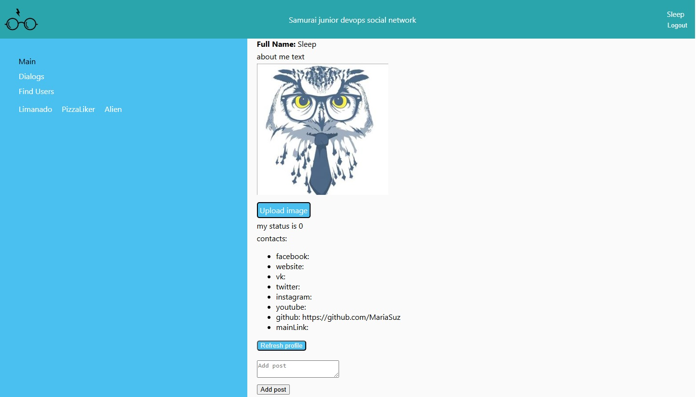

# Samurai junior devops social network

Это учебный проект, представляющий полноценную социальную сеть.

[Ссылка на демонстрацию проекта](https://mariasuz.github.io/react-samurai-project/)

### Стек:

- React
- Redux
- Redux-toolkit
- TypeScript
- React Router
- Hooks
- Axios
- Formik
- Material UI
- Websocket
- API ( Бэкенд взят с [сайта]( https://social-network.samuraijs.com/docs#) )

Проект первоначально был написан на классовых компонентах и JavaScript, сейчас же использованы хуки и Typescript.

