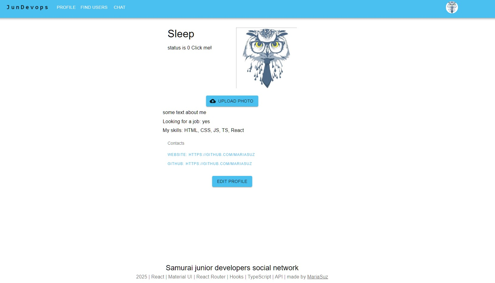

# Samurai junior devops social network

Это учебный проект, представляющий полноценную социальную сеть.  

[Ссылка на демонстрацию проекта](https://mariasuz.github.io/react-samurai-project/) 

### Стек:

- React
- TypeScript
- React Router
- Redux-toolkit
- Redux
- Axios
- Redux-form

Проект первоначально был написан на классовых компонентах и JavaScript, сейчас же использованы хуки и Typescript.
